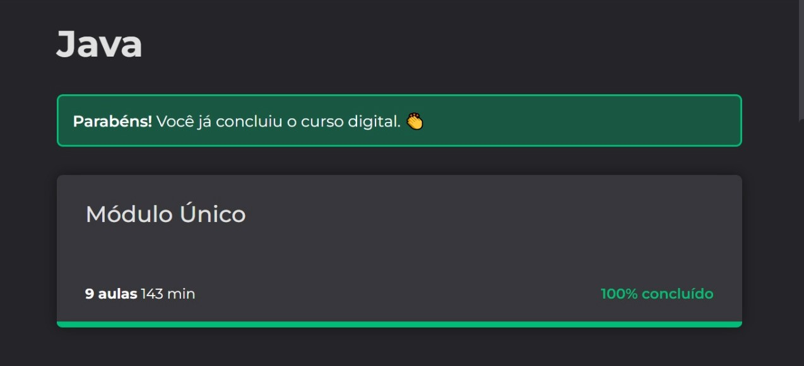

# Introdução ao Java
## Let's Code from Ada.

O curso de introdução ao Java foi disponibilizado gratuitamente para o programa de bolsa de estudo das Americanas. 

O Módulo foi composto de 9 aulas onde aprendi sobre:

- Variaveis
- Operações básicas
- Condicionais
- Ternarios
- Laços
- Arrays
- Funções

## 😲 Certificado Conclusão:

## 👧🏻  Autores:

- [Bethânia Freitas](https://github.com/Bethania-Freitas)

